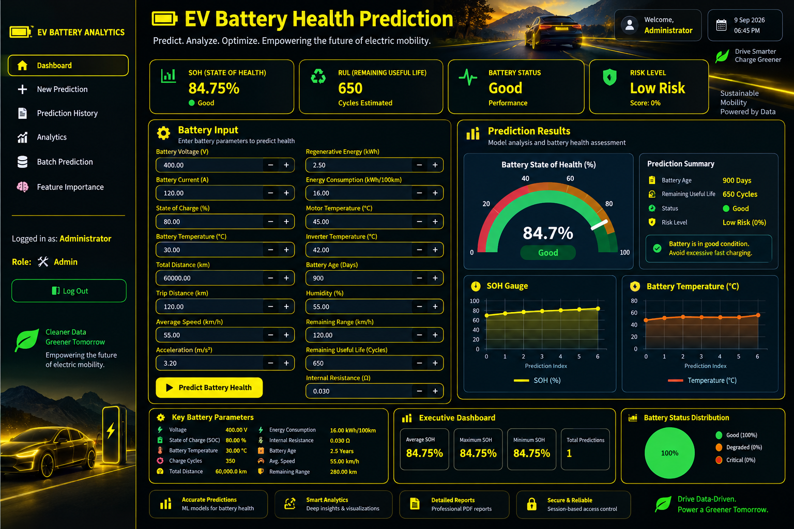

# 🔋 EV Battery Health Prediction System

An end-to-end machine learning project that predicts the **State of
Health (SOH)** of an electric vehicle battery from telemetry data,
compares multiple regression models to identify the best-performing
model, and serves predictions through a dark-themed, role-based
Streamlit dashboard with batch prediction, analytics, prediction
history, and PDF reporting.

[**🚀 Live Demo Coming soon**](#) • [**📊 Model Performance**](#-model-performance)

[](https://www.python.org/)
[](https://streamlit.io/)
[](https://scikit-learn.org/)
[](https://xgboost.readthedocs.io/)
[](LICENSE)

## 📸 Dashboard Preview



------------------------------------------------------------------------

## 🧭 Overview

This project was built as a complete data-science and application
workflow rather than simply training a model in a notebook.

The system takes battery and vehicle telemetry, prepares and analyzes
the data, creates domain-specific features, trains and evaluates
regression models, and exposes the final prediction workflow through a
Streamlit dashboard.

### End-to-end workflow

``` text
Raw Battery Telemetry
        ↓
Preprocessing & Validation
        ↓
Exploratory Data Analysis
        ↓
Feature Engineering
        ↓
Feature Selection
        ↓
Model Training
        ↓
Model Comparison & Tuning
        ↓
Model Evaluation
        ↓
SOH Prediction
        ↓
Streamlit Dashboard
        ↓
Analytics / History / Reports
```

### Main stages

1.  **Preprocessing** --- cleans raw telemetry, validates input ranges,
    and prepares the dataset.
2.  **EDA** --- analyzes distributions, correlations, battery behaviour,
    and model-related patterns.
3.  **Feature engineering** --- derives battery-health and usage
    features from the raw telemetry.
4.  **Feature selection** --- identifies useful predictors using
    statistical and information-based methods.
5.  **Model training** --- trains and compares multiple regression
    algorithms.
6.  **Model tuning** --- performs hyperparameter optimization on
    selected models.
7.  **Evaluation & reporting** --- calculates regression metrics and
    generates visual analysis.
8.  **Serving** --- provides a login-gated Streamlit application for
    single predictions, batch predictions, analytics, history, risk
    scoring, and PDF reports.

------------------------------------------------------------------------

## 📈 Model Performance

The project compares seven regression models for predicting battery SOH.

Example results from one synthetic training run:

  Model                          MAE       RMSE          R²
  ----------------------- ---------- ---------- -----------
  **Gradient Boosting**     **1.88**   **2.45**   **0.960**
  Random Forest                 1.87       2.56       0.956
  XGBoost                       1.96       2.67       0.952
  Linear Regression             2.64       3.27       0.928
  Ridge                         2.65       3.27       0.928
  Lasso                         2.93       3.55       0.915
  Decision Tree                 2.69       3.69       0.908

> These values are from a synthetic run and should be regenerated with
> the dataset used in the repository. They are included as an example of
> the model-comparison workflow, not as a universal benchmark.

The application is designed to select the best-performing model based on
the evaluation results rather than hardcoding one algorithm.

------------------------------------------------------------------------

## ✨ Application Features

### 🔐 Login & Role-Based Access

The application provides a login and registration flow with different
permissions for standard users and administrators.

-   User registration
-   Login/logout
-   Session-based authentication
-   Admin and standard-user roles
-   Admin-only analytics
-   Protected feature-importance section

### 🔋 Single Battery Prediction

Users can enter battery and vehicle telemetry manually and receive:

-   Predicted SOH
-   Battery health status
-   Risk assessment
-   KPI information
-   Maintenance recommendations
-   Prediction history

### 📊 Analytics Dashboard

The application provides visual analysis such as:

-   SOH distribution
-   Prediction history
-   Feature correlation
-   Model feature importance
-   Model coefficients where supported
-   Battery-health statistics
-   Trend analysis

### 📁 Batch Prediction

Multiple battery records can be uploaded through CSV.

``` text
Upload CSV
    ↓
Validate input
    ↓
Prepare features
    ↓
Run trained model
    ↓
Generate SOH predictions
    ↓
Download results
```

### 📄 PDF Battery Health Report

The application can generate a downloadable battery-health report
containing the available prediction and analysis results.

### 🛠️ Admin Dashboard

Administrators can access additional information including:

-   Registered users
-   Total predictions
-   Average predicted SOH
-   Feature importance
-   Model analytics

------------------------------------------------------------------------

## 🛠️ Tech Stack

  Layer               Tools
  ------------------- -----------------------------------------------
  Language            Python 3.10+
  App / UI            Streamlit, custom CSS
  Machine Learning    scikit-learn, XGBoost
  Data Processing     pandas, NumPy, openpyxl
  Visualization       Plotly, Matplotlib
  Model Persistence   joblib
  Database            SQLite
  Reporting           ReportLab
  Authentication      Session-based login, SHA-256 password hashing
  Testing             pytest
  Code Quality        flake8
  CI                  GitHub Actions
  Development         VS Code
  Version Control     Git / GitHub

------------------------------------------------------------------------

## 📁 Project Structure

``` text
ev-battery-health-prediction/
│
├── app.py                              # Streamlit application
│
├── .streamlit/
│   └── config.toml                    # Streamlit theme/configuration
│
├── src/
│   ├── config.py                      # Paths, constants and feature configuration
│   ├── auth.py                        # Login, registration and role handling
│   ├── theme.py                       # Custom UI styling/components
│   ├── preprocess.py                  # Data cleaning and validation
│   ├── feature_engineering.py         # Derived battery-health features
│   ├── feature_selection.py           # Feature selection
│   ├── eda.py                         # Exploratory data analysis
│   ├── models.py                      # Model definitions/registry
│   ├── train_model.py                 # Model training and comparison
│   ├── model_tuning.py                # Hyperparameter tuning
│   ├── evaluate_model.py              # Model evaluation
│   ├── metrics.py                     # Regression metrics
│   ├── plots.py                       # Evaluation visualizations
│   ├── reports.py                     # Report generation
│   ├── validator.py                   # Input validation
│   ├── battery_predictor.py           # Prediction/inference wrapper
│   ├── predict.py                     # Single prediction utility
│   └── utils.py                       # Shared utilities
│
├── tests/
│   └── test_validator.py              # Validation tests
│
├── data/
│   ├── raw/                           # Raw datasets
│   └── processed/                     # Processed datasets
│
├── models/                             # Generated trained models
├── reports/                            # Metrics and reports
├── images/                             # Generated visualizations
│
├── sample_battery_data.csv             # Sample prediction data
├── database.py                          # SQLite/database helpers
├── evaluation.py                       # Additional evaluation utilities
├── analytics.py                        # Application analytics
├── main.py                             # Project helper/entry point
│
├── requirements.txt
├── requirements-dev.txt
├── .gitignore
├── .github/
│   └── workflows/
│       └── ci.yml
├── LICENSE
└── README.md
```

------------------------------------------------------------------------

## 🚀 Getting Started

### 1. Clone the repository

``` bash
git clone https://github.com/<your-username>/ev-battery-health-prediction.git
cd ev-battery-health-prediction
```

### 2. Create a virtual environment

#### Windows

``` bash
python -m venv venv
venv\Scripts\activate
```

#### macOS / Linux

``` bash
python3 -m venv venv
source venv/bin/activate
```

### 3. Install dependencies

``` bash
pip install -r requirements.txt
```

For development and testing:

``` bash
pip install -r requirements-dev.txt
```

------------------------------------------------------------------------

## 🧪 Run the Machine Learning Pipeline

Place the raw dataset in the expected location and run the pipeline from
the project root.

Example:

``` bash
python -m src.preprocess
python -m src.feature_engineering
python -m src.eda
python -m src.feature_selection
python -m src.train_model
python -m src.evaluate_model
```

The exact commands depend on the current implementation of each module.

The training stage produces the trained model artifacts required by the
application.

------------------------------------------------------------------------

## 🖥️ Run the Streamlit Application

From the project root:

``` bash
python -m streamlit run app.py
```

or:

``` bash
streamlit run app.py
```

Then open:

``` text
http://localhost:8501
```

The application starts with the authentication interface before allowing
access to the battery-health analysis features.

------------------------------------------------------------------------

## 🔑 Demo Authentication

For local development, the project may use demo credentials configured
in the authentication module.

Example:

  Username   Password     Role
  ---------- ------------ ---------------
  `admin`    `admin123`   Admin
  `user`     `user123`    Standard User

> **Important:** Change demo credentials before deploying the
> application publicly. Never commit real passwords or secrets to
> GitHub.

------------------------------------------------------------------------

## 📋 Input Data

The prediction pipeline is designed around battery and vehicle
telemetry.

Typical raw columns include:

``` text
battery_voltage
battery_current
soc
battery_temp
ambient_temp
charge_cycles
fast_charge_count
total_distance_km
trip_distance_km
avg_speed_kmh
max_speed_kmh
acceleration_ms2
regenerative_energy_kwh
energy_consumption_kwh_100km
motor_temp
inverter_temp
charging_duration_min
cell_voltage_std
internal_resistance
battery_age_days
humidity
remaining_range_km
rul_cycles
```

The application derives additional features automatically.

------------------------------------------------------------------------

## 🧠 Machine Learning Model

### Prediction target

``` text
Battery State of Health (SOH) %
```

The target represents an estimated battery-health percentage.

### Candidate models

The project compares:

1.  Linear Regression
2.  Ridge Regression
3.  Lasso Regression
4.  Decision Tree
5.  Random Forest
6.  Gradient Boosting
7.  XGBoost

### Evaluation metrics

The model evaluation workflow includes:

-   MAE
-   RMSE
-   R²
-   MAPE
-   Prediction/residual analysis

The final model should be selected from the evaluation results rather
than assuming a specific algorithm will always perform best.

------------------------------------------------------------------------

## 🧮 Feature Engineering

The project derives domain-specific features to capture battery usage,
stress and degradation patterns.

Examples include:

``` text
fast_charge_ratio
battery_stress_index
temperature_difference
avg_distance_per_cycle
power_to_voltage_ratio
range_per_soc
```

The project uses a centralized feature configuration so that training
and inference use the same feature ordering.

This helps prevent one of the common ML deployment problems:
**training/inference feature mismatch**.

------------------------------------------------------------------------

## 🔋 Battery Health Classification

The application can translate predicted SOH into a simple user-facing
status.

           SOH Status
  ------------ -----------
         ≥ 90% Excellent
    80--89.99% Good
    70--79.99% Fair
        \< 70% Poor

These categories are application thresholds and should not be
interpreted as official manufacturer battery-service limits.

------------------------------------------------------------------------

## 🧪 Testing

Run the test suite:

``` bash
pytest tests/ -v
```

For a quick Python syntax check:

``` bash
python -m py_compile app.py
```

For linting, if configured:

``` bash
flake8 .
```

------------------------------------------------------------------------

## 🔐 Security Notes

This project was initially designed as a local/portfolio application.

Before public deployment:

-   Replace demo credentials.
-   Do not commit passwords.
-   Do not commit API keys.
-   Do not commit `.env` files.
-   Do not commit private datasets.
-   Do not commit local user databases.
-   Use a production-grade authentication system.
-   Add rate limiting and account lockout.
-   Use secure secret management.

Example `.gitignore` entries:

``` gitignore
__pycache__/
*.py[cod]

venv/
.venv/
env/

.env
.streamlit/secrets.toml

*.log
*.db
users.db

.vscode/
.idea/

data/raw/*
data/processed/*
```

------------------------------------------------------------------------

## ☁️ Deployment

The application can be deployed using a Streamlit-compatible hosting
platform.

For example, with Streamlit Community Cloud:

1.  Push the project to GitHub.
2.  Create/select the application deployment.
3.  Select the repository.
4.  Select `app.py` as the entry point.
5.  Configure required secrets.
6.  Deploy.

The trained model and required application assets must also be available
to the deployed application.

For public deployment, authentication and secret management should be
upgraded from the local prototype implementation.

------------------------------------------------------------------------

## 📸 Application Screenshots

Recommended screenshots for the GitHub repository:

``` text
assets/
├── login.png
├── dashboard.png
├── prediction.png
├── analytics.png
├── batch_prediction.png
└── admin_dashboard.png
```

Then they can be displayed in the README:

``` markdown


```

------------------------------------------------------------------------

## 🔮 Future Improvements

-   [ ] Real BMS / EV telemetry integration
-   [ ] Real-time battery monitoring
-   [ ] Time-series SOH degradation forecasting
-   [ ] Remaining Useful Life (RUL) prediction
-   [ ] SHAP-based model explainability
-   [ ] Advanced anomaly detection
-   [ ] Production-grade authentication
-   [ ] Persistent production database
-   [ ] Docker deployment
-   [ ] Automated model retraining
-   [ ] Model drift monitoring
-   [ ] Cloud deployment
-   [ ] Automated CI/CD
-   [ ] Expanded test coverage

------------------------------------------------------------------------

## ⚠️ Limitations

This project is an analytical and machine-learning prototype.

Prediction quality depends on the quality, size and representativeness
of the training data. Synthetic or simulated battery data should not be
treated as a replacement for manufacturer-grade BMS diagnostics.

The predicted SOH is therefore an **analytical estimate**, not a
certified measurement of battery condition.

------------------------------------------------------------------------

## 🎯 Project Development Phases

The project was developed progressively through the following stages:

``` text
Phase 1   → Project concept & architecture
Phase 2   → Dataset preparation
Phase 3   → Data preprocessing
Phase 4   → Exploratory data analysis
Phase 5   → Feature engineering
Phase 6   → Feature selection
Phase 7   → Model training & comparison
Phase 8   → Model tuning & evaluation
Phase 9   → Prediction pipeline
Phase 10  → Streamlit dashboard
Phase 11  → Authentication & role-based access
Phase 12  → Analytics & feature importance
Phase 13  → Batch prediction & PDF reporting
Phase 13.5 → Dashboard refinement, history & admin features
Phase 14  → Git/GitHub preparation
Phase 15  → Deployment & production improvements
```

The exact implementation may continue to evolve as additional features
are added.

------------------------------------------------------------------------

## 💡 Why I Built This

I wanted to build a project that combines **machine learning, data
analysis and software development** around a practical EV problem.

Instead of stopping after training a regression model, I built the
surrounding workflow as well:

``` text
Data
 ↓
Cleaning
 ↓
EDA
 ↓
Feature Engineering
 ↓
Feature Selection
 ↓
Machine Learning
 ↓
Evaluation
 ↓
Prediction
 ↓
Dashboard
 ↓
Authentication
 ↓
Analytics
 ↓
Reporting
 ↓
Testing
 ↓
GitHub
 ↓
Deployment
```

The longer-term goal is to develop the project into a more realistic
**EV battery monitoring and predictive-maintenance platform**.

------------------------------------------------------------------------

## 👨‍💻 Author

**Shubham Yadav**

EV Battery Health Prediction System

**Focus:** Python • Machine Learning • Data Analytics • EV Battery
Analytics • Streamlit

------------------------------------------------------------------------